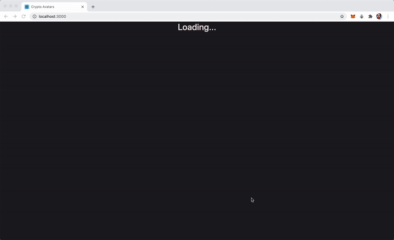

# Crypto Avatar 👾

#### Simple Crypto Avatar Game

### 

#### To use:

- Pre-Install truffle, ganache, metamask: browser extension, node
- Clone this repository
- Open this folder in terminal
- Follow commands-

  - `npm i`
  - `truffle migrate --reset`
  - `cd ./client`
  - `npm i`
  - `npm start`

- Done!

#### Contract rules

      - Contract owner can mint tokens(avatars)
      - Token owner can breed their avatars

###### Few files will be named after CryptoKitty, that's because in the beginning my plan was different

###### \*used solidity compiler version 0.5.7

#### For any queries reach me at parv3213@gmail.com ❤️
